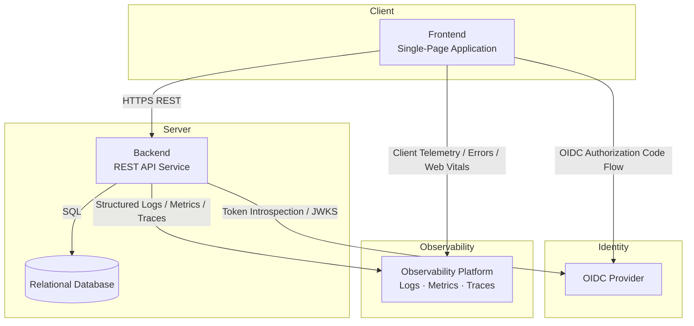
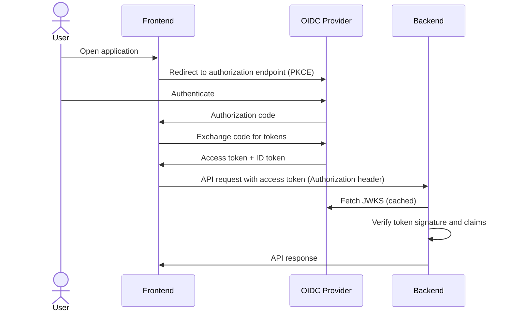

# Task Board: Architecture Overview

## System Components

The application consists of five independent components that communicate over well-defined interfaces.

---

## Frontend

The frontend is a single-page application running entirely in the user's browser.

**Responsibilities:**

- render the user interface and manage client-side navigation between views
- authenticate the user by initiating and completing the OIDC Authorization Code flow
- store and present the access token for outbound API requests
- call the backend REST API for all data operations (reads and writes)
- manage local UI state (loading indicators, optimistic updates, error feedback)
- enforce presentation-level access rules based on the user's role claims from the identity token

**Interfaces:**

- communicates with the backend exclusively over HTTPS using a REST API
- communicates with the OIDC provider to obtain and refresh tokens
- does not connect directly to the database

---

## Backend

The backend is a stateless HTTP service that exposes a REST API and enforces all business logic and authorization decisions.

**Responsibilities:**

- expose REST endpoints for all board, column, and task operations
- validate incoming requests (structure, required fields, business rules)
- enforce authorization: verify the access token on every request and check that the caller has permission to perform the requested operation
- execute business logic (e.g., column deletion rules, archiving constraints)
- persist and retrieve data through the database
- return predictable, versioned API responses and consistent error payloads

**Interfaces:**

- accepts HTTPS requests from the frontend; requires a valid access token on all protected endpoints
- validates tokens by verifying signatures against the OIDC provider's public keys (JWKS endpoint) or via token introspection
- reads from and writes to the relational database
- does not communicate with the frontend directly outside of request/response cycles

---

## Relational Database

The database is the system of record for all persistent application data.

**Responsibilities:**

- store boards, columns, tasks, memberships, comments, and archive state
- enforce referential integrity between entities (e.g., a task must reference a valid board and column)
- support transactional writes to ensure consistency during multi-step operations (e.g., moving a task, deleting a column with reassignment)
- provide the schema migration history as an auditable, version-controlled artifact

**Interfaces:**

- accessed exclusively by the backend service; the frontend has no direct database access
- schema changes are applied through versioned, sequential migrations

---

## OIDC Provider

The OIDC provider is the central identity authority. It handles all user authentication and issues tokens that the rest of the system trusts.

**Responsibilities:**

- authenticate users (username/password, SSO, MFA — depending on configuration)
- issue ID tokens, access tokens, and refresh tokens following the OpenID Connect specification
- expose a JWKS endpoint so the backend can verify token signatures without a round-trip on every request
- manage token lifetimes, revocation, and refresh

**Interfaces:**

- the frontend initiates the Authorization Code flow (with PKCE) by redirecting the user to the provider's authorization endpoint
- after successful authentication, the provider redirects back to the frontend with an authorization code, which is exchanged for tokens
- the backend fetches the provider's public keys (JWKS) to validate access tokens on incoming requests
- the OIDC provider does not communicate with the database or backend directly

---

## Observability Infrastructure

The observability platform is a passive receiver of telemetry from all other components. It provides the operational visibility needed to detect, diagnose, and respond to issues in production.

**Responsibilities:**

- collect and store structured logs emitted by the backend, indexed for search and correlation
- aggregate metrics that reflect service health, throughput, error rates, and resource saturation
- receive and store distributed traces that show the end-to-end path of individual requests through the system
- collect client-side telemetry from the frontend: JavaScript errors, failed API calls, and browser performance signals (Core Web Vitals)
- provide querying, dashboards, and alerting over the collected data
- retain telemetry for a defined period to support incident investigation and trend analysis

**Interfaces:**

- the backend pushes logs, metrics, and trace spans continuously during normal operation; no request from the observability platform is required
- the frontend sends client telemetry (errors, performance events) asynchronously without affecting the user-facing request path
- the observability platform does not call the backend or frontend; it only receives data
- the observability platform does not have access to the database or the OIDC provider directly

**What each component emits:**

| Component | Logs | Metrics | Traces | Client Telemetry |
|---|---|---|---|---|
| Frontend | | | | Errors, Web Vitals, failed requests |
| Backend | Structured logs with correlation IDs | Request rate, error rate, latency, saturation | Spans for inbound requests and outbound DB calls | |
| Database | | Connection pool usage (via backend) | | |

---

## Authentication and Authorization Flow

---

## Key Architectural Principles

- **Stateless backend**: the backend service does not store session state. All identity context is carried in the access token on each request.
- **Single source of truth for identity**: the OIDC provider owns authentication. The backend trusts token claims; it does not manage passwords or sessions.
- **Database as the only persistence boundary**: the frontend holds no persistent state. All data is fetched from and committed to the backend, which persists it in the database.
- **Separation of authorization layers**: the frontend enforces presentation-level rules (e.g., hiding buttons) for UX purposes only. The backend re-enforces all authorization rules independently on every request.
- **Versioned API contract**: the backend exposes a stable, explicitly versioned API so the frontend and backend can evolve independently.
- **Observability as a first-class concern**: all components emit telemetry from the start. Logs carry correlation IDs so frontend errors, backend requests, and database operations can be linked across the full request path.
