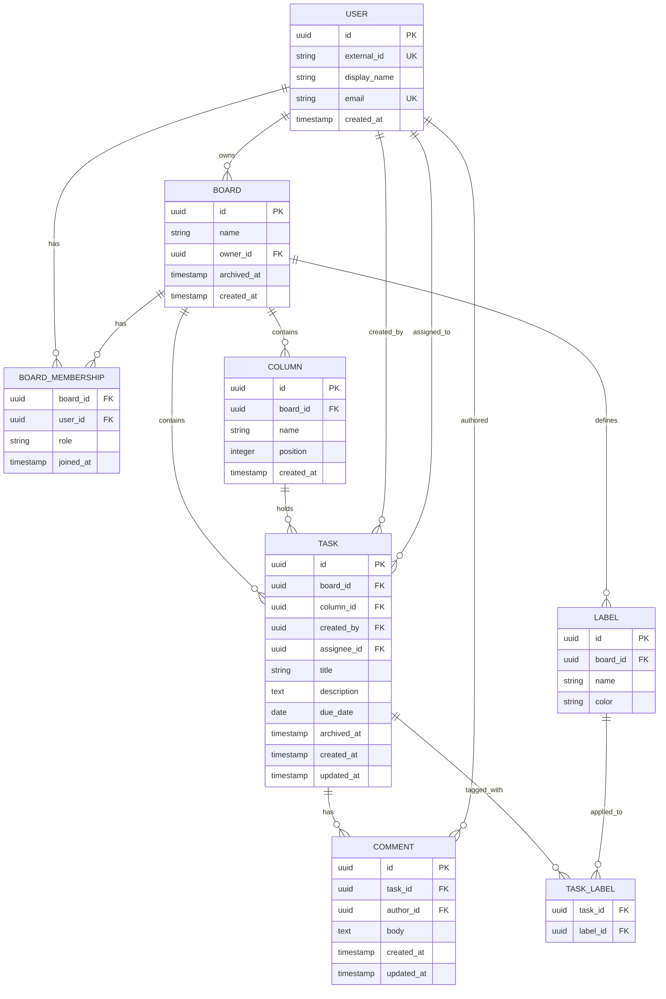

# Task Board: Database Schema

## Overview

The schema stores all application data in a relational database. It is organized around five core entities — users, boards, columns, tasks, and comments — with supporting tables for memberships and labels.

---

## Tables

### `user`

Stores the identity of every person who has accessed the application. User records are created on first login by mapping the subject claim from the OIDC access token.

| Column | Type | Constraints | Description |
|---|---|---|---|
| `id` | UUID | PK | Internal identifier |
| `external_id` | VARCHAR | NOT NULL, UNIQUE | Subject claim (`sub`) from the OIDC token |
| `display_name` | VARCHAR | NOT NULL | Human-readable name shown in the UI |
| `email` | VARCHAR | NOT NULL, UNIQUE | Email address from the OIDC identity token |
| `created_at` | TIMESTAMP | NOT NULL | When the user record was first created |

**Notes:**

- `external_id` is the authoritative link between the OIDC provider and the application's user records. All other fields may be refreshed from the identity token on login.
- Users are never hard-deleted. Tasks, comments, and memberships reference user records and must remain consistent.

---

### `board`

Represents a workspace for a project or team.

| Column | Type | Constraints | Description |
|---|---|---|---|
| `id` | UUID | PK | Internal identifier |
| `name` | VARCHAR | NOT NULL | Display name of the board |
| `owner_id` | UUID | NOT NULL, FK → `user.id` | The current owner of the board |
| `archived_at` | TIMESTAMP | NULLABLE | Set when the board is archived; null if active |
| `created_at` | TIMESTAMP | NOT NULL | When the board was created |

**Notes:**

- Ownership transfer updates `owner_id` in a single transaction.
- Archived boards (where `archived_at IS NOT NULL`) are excluded from active board listings by default.

---

### `board_membership`

Records which users have access to a board and in what role.

| Column | Type | Constraints | Description |
|---|---|---|---|
| `board_id` | UUID | NOT NULL, FK → `board.id` | The board the membership applies to |
| `user_id` | UUID | NOT NULL, FK → `user.id` | The user granted access |
| `role` | VARCHAR | NOT NULL | One of: `owner`, `member`, `viewer` |
| `joined_at` | TIMESTAMP | NOT NULL | When the membership was created |

**Primary key:** (`board_id`, `user_id`)

**Notes:**

- The board owner always has a corresponding membership row with `role = 'owner'`.
- When ownership is transferred, the old owner's membership row is updated to `role = 'member'` and the new owner's row is set to `role = 'owner'`.
- Removing a member deletes their membership row. This does not affect tasks they created or are assigned to.

---

### `column`

Represents a workflow stage within a board.

| Column | Type | Constraints | Description |
|---|---|---|---|
| `id` | UUID | PK | Internal identifier |
| `board_id` | UUID | NOT NULL, FK → `board.id` | The board this column belongs to |
| `name` | VARCHAR | NOT NULL | Display name of the column |
| `position` | INTEGER | NOT NULL | Zero-based display order within the board |
| `created_at` | TIMESTAMP | NOT NULL | When the column was created |

**Unique constraint:** (`board_id`, `position`) — no two columns on the same board share a position.

**Notes:**

- Reordering columns updates `position` values for all affected rows in a single transaction.
- Deleting a column either moves its tasks to another column or deletes them, both in a single transaction, before the column row is removed.

---

### `task`

Represents a discrete unit of work on a board.

| Column | Type | Constraints | Description |
|---|---|---|---|
| `id` | UUID | PK | Internal identifier |
| `board_id` | UUID | NOT NULL, FK → `board.id` | The board this task belongs to |
| `column_id` | UUID | NOT NULL, FK → `column.id` | The current column the task resides in |
| `created_by` | UUID | NOT NULL, FK → `user.id` | The user who created the task |
| `assignee_id` | UUID | NULLABLE, FK → `user.id` | The user currently assigned to the task |
| `title` | VARCHAR | NOT NULL | Short description of the work |
| `description` | TEXT | NULLABLE | Detailed description or acceptance criteria |
| `due_date` | DATE | NULLABLE | Target completion date |
| `archived_at` | TIMESTAMP | NULLABLE | Set when the task is archived; null if active |
| `created_at` | TIMESTAMP | NOT NULL | When the task was created |
| `updated_at` | TIMESTAMP | NOT NULL | When any field on the task was last changed |

**Constraint:** `column_id` must reference a column that belongs to the same `board_id`.

**Notes:**

- Moving a task updates `column_id` only; `board_id` never changes after creation.
- Archived tasks (`archived_at IS NOT NULL`) are excluded from active task listings by default. They are read-only until restored.
- Deleting a task cascades to its comments and task-label associations.

---

### `comment`

Stores user comments attached to a task.

| Column | Type | Constraints | Description |
|---|---|---|---|
| `id` | UUID | PK | Internal identifier |
| `task_id` | UUID | NOT NULL, FK → `task.id` | The task this comment belongs to |
| `author_id` | UUID | NOT NULL, FK → `user.id` | The user who wrote the comment |
| `body` | TEXT | NOT NULL | Comment content |
| `created_at` | TIMESTAMP | NOT NULL | When the comment was posted |
| `updated_at` | TIMESTAMP | NULLABLE | Set when the comment body was last edited |

**Notes:**

- Comments are deleted when their parent task is deleted (cascade).
- Comments on archived tasks remain readable but cannot be added or edited.

---

### `label`

Defines named tags scoped to a board that can be applied to tasks.

| Column | Type | Constraints | Description |
|---|---|---|---|
| `id` | UUID | PK | Internal identifier |
| `board_id` | UUID | NOT NULL, FK → `board.id` | The board this label belongs to |
| `name` | VARCHAR | NOT NULL | Display name of the label |
| `color` | VARCHAR | NULLABLE | Optional display color (e.g., hex code) |

**Unique constraint:** (`board_id`, `name`) — label names are unique within a board.

**Notes:**

- Deleting a label removes all corresponding rows from `task_label` in the same transaction.

---

### `task_label`

Associates labels with tasks. A task can have multiple labels; a label can be applied to multiple tasks.

| Column | Type | Constraints | Description |
|---|---|---|---|
| `task_id` | UUID | NOT NULL, FK → `task.id` | The task being tagged |
| `label_id` | UUID | NOT NULL, FK → `label.id` | The label being applied |

**Primary key:** (`task_id`, `label_id`)

**Constraint:** `label_id` must reference a label that belongs to the same board as the task.

---

## Indexes

| Table | Columns | Purpose |
|---|---|---|
| `user` | `external_id` | Fast lookup on login by OIDC subject claim |
| `user` | `email` | Lookup when inviting members by email |
| `board_membership` | `user_id` | List all boards a user belongs to |
| `column` | `board_id`, `position` | Ordered column listing per board |
| `task` | `board_id`, `column_id` | Task listing per column |
| `task` | `assignee_id` | Personal task view across boards |
| `task` | `board_id`, `archived_at` | Separate active and archived task queries |
| `comment` | `task_id` | Comment listing per task |
| `task_label` | `label_id` | Find all tasks carrying a specific label |

---

## Schema Migration Discipline

- Every schema change is applied through a versioned, sequential migration script.
- Migrations are stored in version control alongside application code.
- Each migration is forward-only; rollback behavior is handled by additive compensating migrations rather than destructive reversals where possible.
- Breaking changes to existing columns (renames, type changes) are avoided in favor of additive steps (add new column → migrate data → remove old column) to preserve compatibility during deployments.
